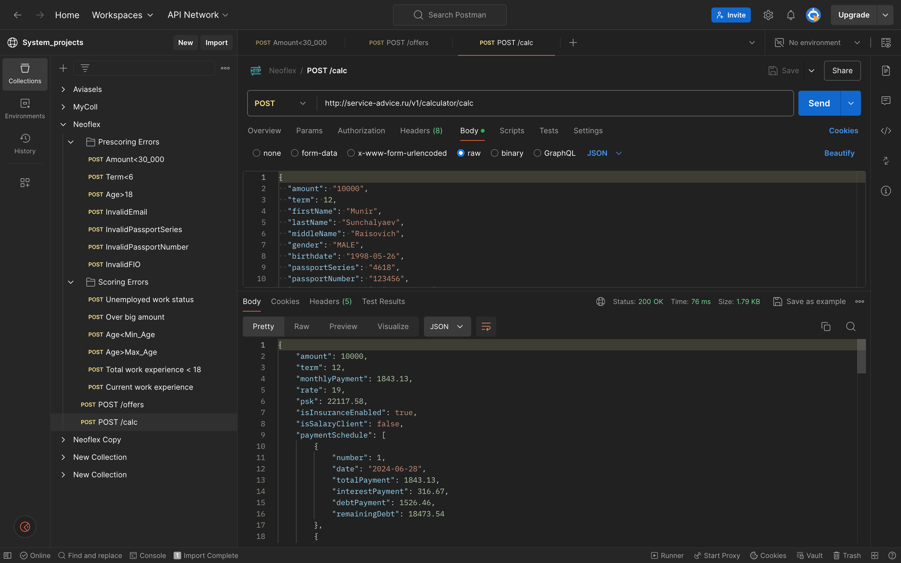
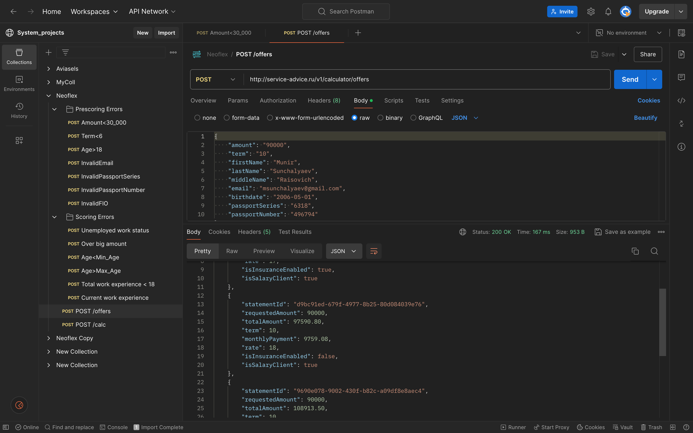
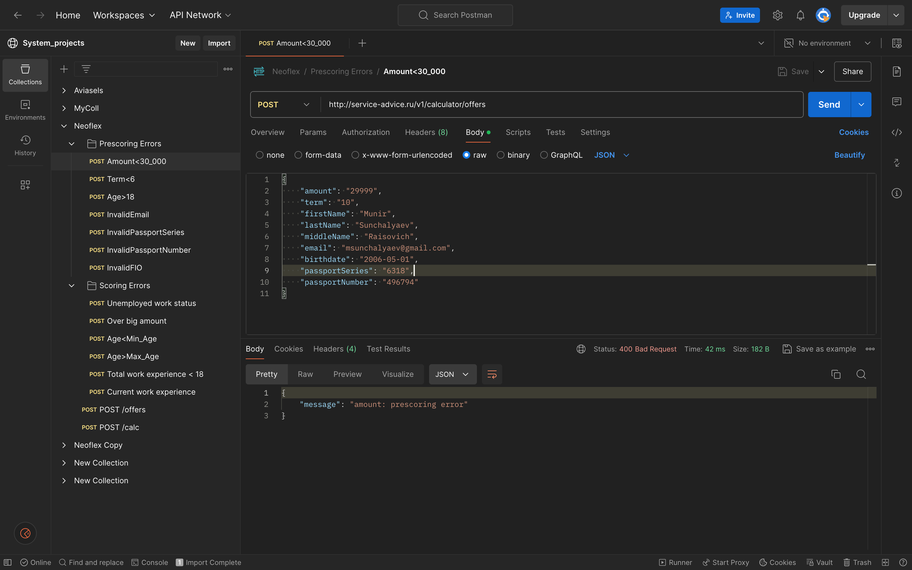
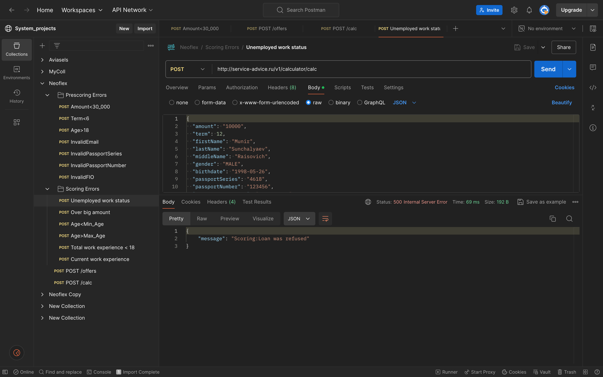

# MVP Level 1 реализация микросервиса Калькулятор
## Реализация
Реализовано два профиля default(используется по умолчанию) и differentiated_payment. В первом профиле применяется
метод расчета кредита с аннуитентными выплатами класс [CreditCalculatorWithAnnuityPayments](src/main/java/com/munsun/calculator/services/impl/providers/impl/CreditCalculatorWithAnnuityPayments.java),
во втором - расчет с дифферецированными выплатами [CreditCalculatorWithDifferentPayments](src/main/java/com/munsun/calculator/services/impl/providers/impl/CreditCalculatorWithDifferentPayments.java).

Логи вынесены в аспекты, доступные в папке [aspects](src/main/java/com/munsun/calculator/aspects). UPD: добавлено логирование для расчета возможных предложений и всего связаного с ними.
для этого применил следующие стратегию: DTO объекты и результаты расчетов логируются на уровне debug, а на уровне info оповещение о начале/окончании расчета.

Прескоринг реализован на уровне валидации и при неудаче МС возвращает [ErrorMessageDto](src/main/java/com/munsun/calculator/dto/response/ErrorMessageDto.java)
c возможной причиной.

Скоринг реализован в сервисном слое и при неудаче МС возвращает [ErrorMessageDto](src/main/java/com/munsun/calculator/dto/response/ErrorMessageDto.java)
с ошибкой [ScoringException](src/main/java/com/munsun/calculator/exceptions/ScoringException.java), причина, в отличие от прескоринга
в мессадж не передается, а лишь логируется. Фильтры поделены на [hard](src/main/java/com/munsun/calculator/services/impl/providers/impl/filters/impl/hard), отказывающие при невыполнении условий фильтров, и 
[soft](src/main/java/com/munsun/calculator/services/impl/providers/impl/filters/impl/soft), изменяющие процентную ставку и добавляющие стоимость доп. услуг, например, страховка.
UPD: добавлен новый интерфейс [ScoringLoanFilter](src/main/java/com/munsun/calculator/services/impl/providers/impl/filters/ScoringLoanFilter.java),
переопределяя который можно влиять на расчет возможных предложений по кредитам, по умолчанию при расчете используются только два фильтра
[SalaryClientSoftScoringFilter](src/main/java/com/munsun/calculator/services/impl/providers/impl/filters/impl/soft/InsuranceSoftScoringFilter.java) и
[InsuranceSoftScoringFilter](src/main/java/com/munsun/calculator/services/impl/providers/impl/filters/impl/soft/InsuranceSoftScoringFilter.java), 
однако реализация позволяет добавлять значительное большее количество при возможном расширении. Также 
добавлен [SimpleScoringInfoDto](src/main/java/com/munsun/calculator/dto/utils/SimpleScoringInfoDto.java) для работы с ними.

UPD: Документация по API в формате json доступна [здесь](api-docs.json), настроены эндпоинты **/calculator/api-docs-ui** и **/calculator/api-docs**.

Запросы для импорта в Postman [здесь](Neoflex.postman_collection.json) для последующего тестирования с локальной машиной,
с удаленной - по [ссылке](https://www.postman.com/navigation-candidate-51855014/workspace/system-projects/collection/27612511-0ad9e853-7906-4e4c-8504-e076b5361815?action=share&creator=27612511).

UPD: Отчеты по покрытию тестами выполнялись при помощи Jacoco и находятся [здесь](htmlReport). Покрытие составляет 96%.
## Запуск
Перейти в корень и собрать проект:
```
mvn clean package
```
или без прогона тестов
```
mvn clean package -DskipTests=true
```
После сборки, запустить проект:
```
java -jar target/Calculator-0.0.1-SNAPSHOT.jar
```
Или, предварительно запустив docker-daemon:
```
docker compose up
```
Также сервис развернут удаленно по адресу [http://service-advice.ru](http://service-advice.ru)
## Примеры запуска
Вычисление кредита


Вычисление предложений


Ошибка прескоринга


Ошибка скоринга 
