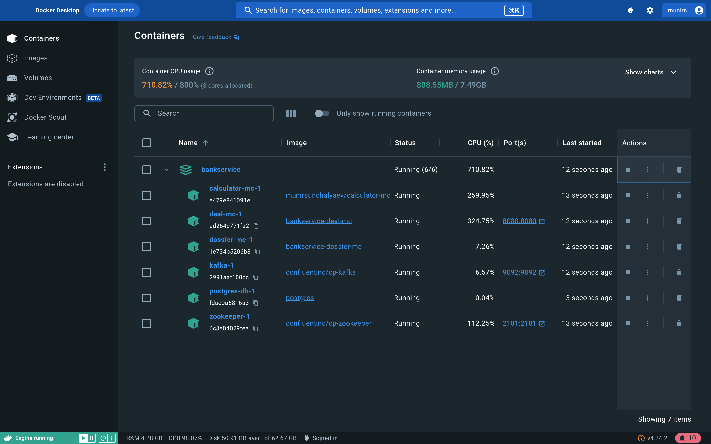
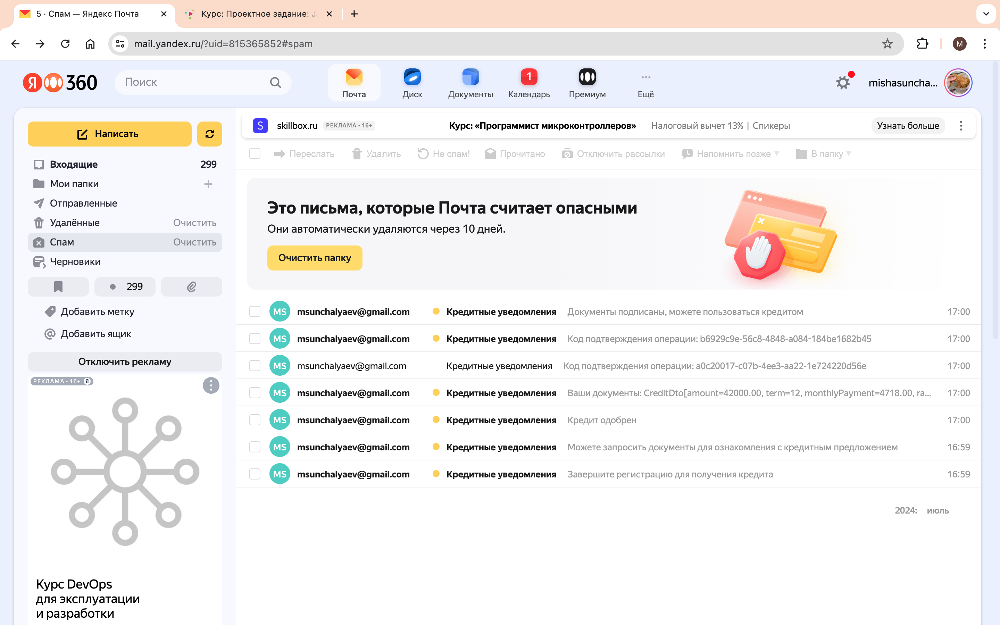

# MVP 4 "Настройка уведомлений о ходе сделки"
## Реализация
- создан новый сервис Dossier, который взаимодействует с брокером сообщений и отправляет документы
на email пользователя;
- изменен сервис Deal: добавлены новый эндпоинты, взаимодействие с брокером.

Темы для брокера могут создаваться как со стороны Dossier, так и со стороны Deal.
Не могу понять, где их создавать, так то можно и в пропертях докер образа кафки указать или
через скрипт. Думаю, что все же на уровне приложения, потому что темы - это часть бизнес логики 
и незачем их выносить на уровень ниже.

В описании к заданию явно не описано как должны выглядеть документы или как в [EmailMessage](com/munsun/dossier/queries/payload/EmailMessage.java)
передать код подтверждения и документы, поэтому создал новые сущности с доп. полями 
[EmailMessageWithSesCode](com/munsun/dossier/queries/payload/EmailMessageWithSesCode.java) и 
[EmailMessageWithCreditCode](com/munsun/dossier/queries/payload/EmailMessageWithCreditDto.java).
В качестве документов высылается CreditDto в формате JSON(как время останется изучу либу по преобразованию
POJO в pdf и допилю).

Все конфиги, связанные с mail sender, в gitignore, поэтому просто запустить и прочекать работу не получится,
поэтому оставляю скрины с уведомлениями.

## Примеры работы
Запуск

Почтовые уведомления

